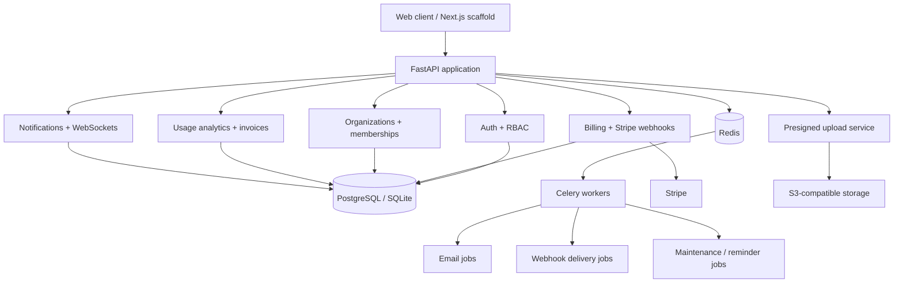
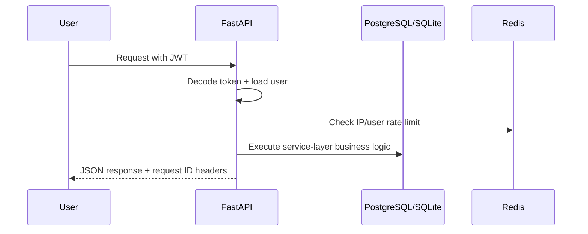
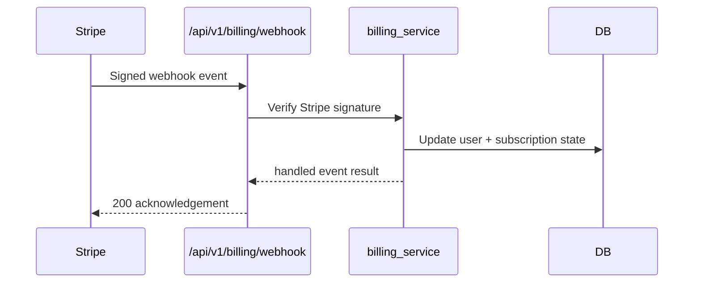
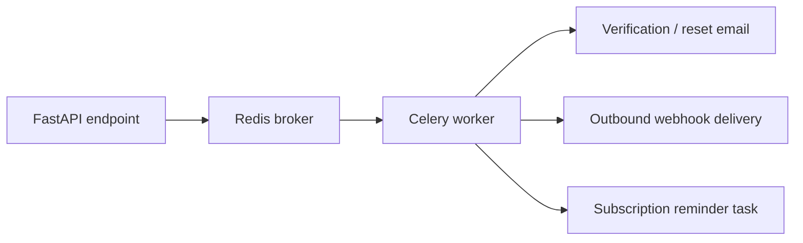
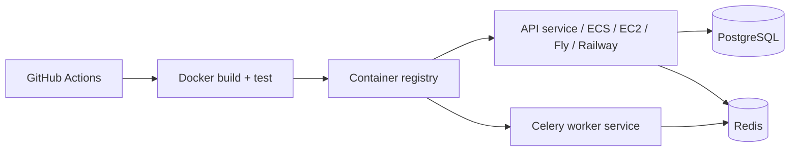

# SaaS Boilerplate

Production-style FastAPI SaaS foundation for teams that do not want to rebuild auth, billing, async jobs, multi-tenancy, RBAC, webhooks, analytics, uploads, and admin tooling from scratch.

This repo is intentionally positioned as a backend platform starter, not just a demo API. It combines a layered FastAPI backend, Stripe billing, Redis/Celery background work, tenant-aware organization access, audit logging, and a lightweight Next.js frontend scaffold.

## Why This Project Exists

Most SaaS teams repeatedly rebuild the same platform concerns:

- authentication and token lifecycle
- subscription and billing flows
- role-based access control
- background job infrastructure
- webhook delivery and retries
- organization and tenant boundaries
- admin and audit surfaces

This project provides a reusable starting point so product work can begin on top of a stronger operational baseline.

## What’s Included

- JWT auth with refresh tokens, password reset, email verification, and TOTP 2FA
- RBAC plus organization-scoped tenant access controls
- Stripe checkout, billing portal, subscriptions, invoices, and webhook intake
- Redis-backed IP and plan-aware rate limiting
- Celery workers for email delivery, webhook delivery, and recurring maintenance jobs
- WebSocket notifications and in-app notification persistence
- Usage analytics, audit logging, API keys, and presigned S3 uploads
- Admin APIs for user management and platform stats
- Docker Compose stack, Alembic migrations, and GitHub Actions CI
- Lightweight Next.js frontend scaffold for auth and dashboard surfaces

## Roadmap Audit

The original day-by-day build plan is largely complete in code. A detailed implementation audit lives in [docs/roadmap-audit.md](docs/roadmap-audit.md), but the short version is:

| Phase | Status | Notes |
| --- | --- | --- |
| Day 1: project setup, DB, migrations | Complete | Async SQLAlchemy, Alembic, Docker |
| Day 2: auth | Complete | Register, login, refresh, logout, password reset, email verification |
| Day 3: RBAC and middleware | Complete | Role checks, request logging, rate limiting |
| Day 4: billing | Complete | Stripe checkout, portal, webhook ingestion, subscription syncing |
| Day 5: async jobs | Complete | Celery, email tasks, webhook tasks, maintenance tasks |
| Day 6: tests and CI | Complete | Pytest coverage plus GitHub Actions |
| Day 7: admin, logging, health | Complete | Admin APIs, audit logs, health/live/readiness endpoints |
| Phase 2: multi-tenancy, uploads, realtime | Complete | Organizations, presigned uploads, WebSockets |
| Phase 3: security and analytics | Complete | 2FA, API keys, notifications, usage analytics, invoice generation |

## Architecture



### Request Lifecycle



### Stripe Webhook Flow



### Async Work Flow



## Multi-Tenancy Model

The boilerplate now enforces org-aware access rather than treating organizations as passive records.

- every organization creator becomes the initial `owner`
- member listing requires active org membership
- member management requires `owner` or `admin` membership
- the last active owner cannot be removed
- organization slugs are created uniquely to avoid collisions

This keeps tenant operations aligned with real SaaS access patterns instead of just exposing CRUD routes.

## Engineering Decisions

- Hybrid platform design: keep the HTTP layer thin and move business logic into `services/`
- Stateless API: JWT auth keeps API instances horizontally scalable
- Redis-backed controls: rate limiting and Celery brokering both rely on Redis for fast coordination
- Async-first persistence: SQLAlchemy async sessions and FastAPI async endpoints keep IO-bound paths efficient
- Fail-open peripheral systems: rate limiting falls open when Redis is unavailable so core product paths remain reachable
- Explicit tenant authorization: organization membership is verified server-side for scoped operations

## Folder Structure

```text
SaaSboilerplate/
├── app/
│   ├── api/v1/endpoints/   # Route handlers grouped by domain
│   ├── core/               # Config, security, rate limits, middleware
│   ├── db/                 # Engine, sessions, base metadata
│   ├── models/             # SQLAlchemy entities
│   ├── schemas/            # Pydantic request/response models
│   ├── services/           # Business logic and orchestration
│   ├── tasks/              # Celery jobs and periodic work
│   ├── utils/              # Email and token helpers
│   └── websocket/          # Connection manager for realtime events
├── alembic/                # Schema migrations
├── frontend/               # Next.js auth + dashboard scaffold
├── tests/                  # API and service-level behavior checks
├── docs/                   # Architecture, ops, and roadmap audit docs
├── Dockerfile
├── docker-compose.yml
├── Makefile
└── requirements.txt
```

## Local Setup

Recommended local/runtime version: `Python 3.12`

### 1. Configure environment

```bash
cp .env.example .env
```

The example file now mirrors the real runtime settings used by the application.

### 2. Run with Docker Compose

```bash
docker-compose up --build
```

This starts:

- `api` on `http://localhost:8000`
- `db` on `localhost:5432`
- `redis` on `localhost:6379`
- `worker`, `beat`, and `flower`

### 3. Run locally without Docker

```bash
pip install -r requirements.txt
alembic upgrade head
uvicorn app.main:app --reload
```

### 4. Frontend scaffold

```bash
cd frontend
npm install
npm run dev
```

## Developer Experience

A small `Makefile` is included to speed up common flows:

```bash
make install
make api
make worker
make beat
make test
make up
make down
```

## API Surface

When running locally:

- Swagger UI: [http://localhost:8000/docs](http://localhost:8000/docs)
- ReDoc: [http://localhost:8000/redoc](http://localhost:8000/redoc)

Core route groups:

- `/api/v1/auth`
- `/api/v1/billing`
- `/api/v1/orgs`
- `/api/v1/security`
- `/api/v1/webhooks`
- `/api/v1/analytics`
- `/api/v1/admin`
- `/api/v1/files`
- `/api/v1/notifications`
- `/api/v1/health`

## Testing

The test suite now covers more than just auth happy paths.

- auth registration, duplicate prevention, login, and `/me`
- email verification and password flow behavior
- billing plan listing, status, and webhook signature validation
- RBAC and protected feature access
- organization membership isolation and owner protection
- security flows for API keys and TOTP enable/disable
- health and readiness checks
- admin listing and role updates

Run tests with:

```bash
pytest
```

## Security Posture

- password hashing via `passlib`
- JWT access and refresh token flow
- Redis-backed token blacklisting and verification/reset tokens
- TOTP-based two-factor authentication
- role-based access control for admin routes
- org-scoped authorization for tenant operations
- IP and plan-aware rate limiting
- Stripe signature verification for billing webhooks
- request validation through Pydantic schemas
- request IDs returned in response headers for traceability

## Observability and Operations

Implemented today:

- structured request logging middleware
- request latency headers
- liveness, DB health, and readiness endpoints
- audit logging for security, billing, and admin events
- notification persistence for user-visible events

Current operational docs:

- [Architecture deep dive](docs/architecture.md)
- [Operations and failure handling](docs/operations.md)
- [Roadmap audit](docs/roadmap-audit.md)

## Failure Handling

The project now documents and partially handles common SaaS failure modes:

- Redis unavailable: rate limiting fails open so user traffic is not fully blocked
- Stripe signature mismatch: webhook requests are rejected with `400`
- Last org owner removal: blocked to prevent orphaned tenants
- Background worker unavailability: webhook dispatch falls back to queued-local status
- DB readiness issues: `/health/ready` reports degraded status with `503`

## Scalability Considerations

- API layer is stateless and can scale horizontally behind a reverse proxy
- Redis externalizes queueing and rate limiting concerns
- Celery separates latency-sensitive HTTP paths from background work
- tenant data is modeled explicitly for future tenant-aware middleware and query scoping
- presigned uploads avoid proxying large file payloads through the API
- WebSocket notifications are isolated behind a connection manager that can later move to a shared pub/sub strategy

## Frontend Surface

The included Next.js app is intentionally lightweight. It is there to prove product surface area and provide an easy starting point for:

- login / registration flows
- dashboard shells
- subscription settings
- organization settings
- notification center

It should be treated as a starter UI, not a fully finished SaaS frontend.

## Deployment

The repo is prepared for containerized deployment:

- `Dockerfile` for the API image
- `docker-compose.yml` for local full-stack orchestration
- GitHub Actions CI for tests and linting

A typical production path would be:



## Limitations

This repo is stronger than a tutorial scaffold, but it is still honest about what remains:

- observability is logging-first today, not full OpenTelemetry or Prometheus/Grafana
- no Terraform or infrastructure-as-code layer yet
- frontend is scaffold-grade, not full product UX
- webhook delivery retries and dead-letter behavior can be extended further
- no usage metering-based billing engine yet
- tenant context is enforced on org routes but not propagated as a first-class middleware across every future domain

## Roadmap

- [ ] OpenTelemetry tracing and metrics export
- [ ] Prometheus/Grafana local stack
- [ ] Terraform infra definitions
- [ ] stronger webhook retry + dead-letter strategy
- [ ] feature flags and usage metering
- [ ] richer frontend account, billing, and org settings pages
- [ ] shared tenant context middleware for all tenant-scoped modules

## Useful Docs

- [Architecture deep dive](docs/architecture.md)
- [Operations and failure handling](docs/operations.md)
- [Roadmap audit](docs/roadmap-audit.md)
