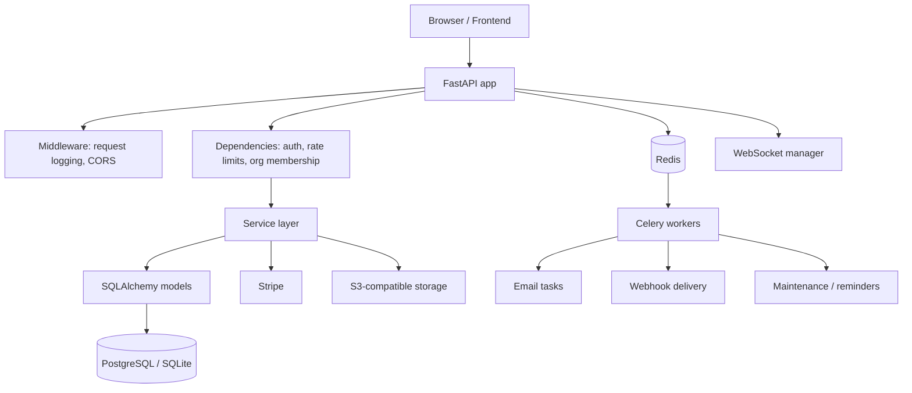
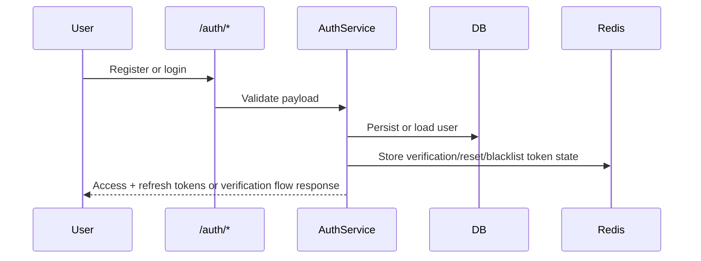
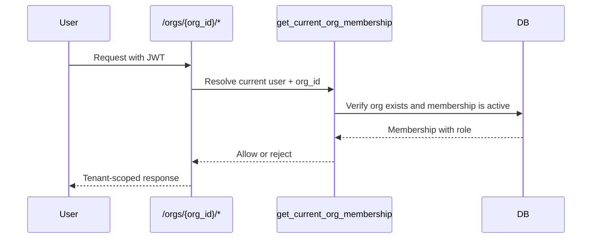
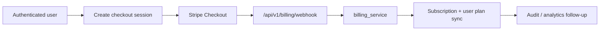
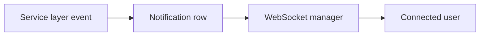

# Architecture Deep Dive

## System Overview

## Why The Layers Exist

### `api/v1/endpoints/`

These files expose HTTP surfaces and should stay thin. They translate requests into service calls, manage dependency injection, and return response payloads.

### `services/`

Business logic lives here so Stripe, org management, analytics, audit logging, and notifications can evolve independently from transport concerns.

### `core/`

Shared runtime concerns such as settings, middleware, security, permissions, and rate limiting are centralized here to keep feature modules smaller and more predictable.

### `tasks/`

Anything that should not block a request path belongs in Celery tasks. This includes:

- email delivery
- outbound webhook delivery
- scheduled maintenance
- future retries or reporting jobs

## Auth Flow

## Tenant Access Flow

## Stripe Billing Flow

## Realtime Notifications

## Async Philosophy

The boilerplate uses Celery because SaaS products accumulate slow, failure-prone, or retry-heavy work quickly. Background workers protect request latency and create a cleaner place for:

- retries
- backoff
- email sends
- outbound webhooks
- subscription reminder jobs

## Current Limits

- tenant context is enforced on organization routes, but future tenant-heavy modules should share a first-class tenant middleware
- observability is request-log and health-check oriented today, not full tracing
- WebSockets are in-process today, so horizontal scale would eventually benefit from shared pub/sub
